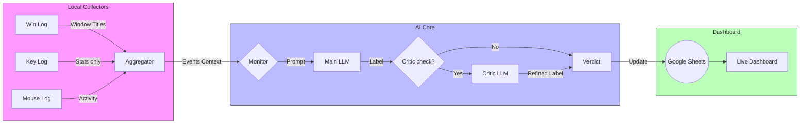

# Focus Monitor: AI-Powered Productivity Insights

## Slide 1: The Problem
**"How do we measure focus without invading privacy?"**

*   **Challenge**: Traditional time-trackers are invasive (screenshots, full keylogs) or manual (timers).
*   **Gap**: We need *objective* data on "flow state" versus "distraction" without recording sensitive content.
*   **Hypothesis**: Typing *patterns* (cadence, pauses, editing) contain enough signal to determine focus, even without knowing *what* is being typed.

---

## Slide 2: The Solution
**"Privacy-First Telemetry + AI Analysis"**

Analysis, not Surveillance.
*   **Metric-Based**: Logs keystroke metadata (KPM, burstiness, backspace rate) — *never* the raw text.
*   **Context-Aware**: Uses active window titles to understand the *environment* (VS Code vs. Reddit).
*   **AI-Powered Judgement**: Leverages LLMs (GPT-4/5) to classify behavior as "On Task" or "Off Task" based on these signals.

---

## Slide 3: System Architecture
**"How the Data Flows"**

---

## Slide 4: The "Critic" Loop
**"Trust but Verify"**

*   **Concept**: AI isn't perfect. It can hallucinate "On Task" status even when you're just browsing.
*   **The Critic**: A secondary, stricter model review.
    *   *Trigger*: If the Main Model says "On Task" but evidence is weak (e.g., "Reading" for 5 minutes with 0 interaction).
    *   *Action*: The Critic re-evaluates the evidence.
    *   *Result*: Drastically reduced False Positives.

---

## Slide 5: Live Demo Script
**"Showing it in Action"**

1.  **Start the Engine**:
    *   Open Terminal.
    *   Run `python monitor-sheets.py` (or the bat file).
    *   *Narrator*: "The system starts collecting privacy-safe telemetry in the background."

2.  **Phase 1: Deep Work**:
    *   Open VS Code and write some Python code for 30 seconds.
    *   *Narrator*: "I'm coding now. High KPM, frequent special characters."
    *   **Show Sheets**: Watch the row update to **ON TASK** (Reason: "Coding activity detected").

3.  **Phase 2: Distraction**:
    *   Switch to a browser tab (e.g., YouTube or a game).
    *   Watch a video (low interaction, mouse only).
    *   *Narrator*: "Now I'm distracted. Low KPM, mostly passive."
    *   **Show Sheets**: Watch the row update to **OFF TASK** (Reason: "Passive consumption detected").

4.  **Phase 3: The Critic**:
    *   Try to "trick" it by typing random keys in a game.
    *   **Show Logs**: Highlight where the Critic intervenes: "Main model said On Task, but Critic corrected to Off Task due to gibberish patterns."

---

## Slide 6: Future Roadmap
*   **Self-Correction**: Fine-tuning loop based on user corrections.
*   **hosted Dashboard**: Moving from Sheets to a dedicated web app.
*   **Screenshot Integration**: Optional, strictly local analysis for higher accuracy.

